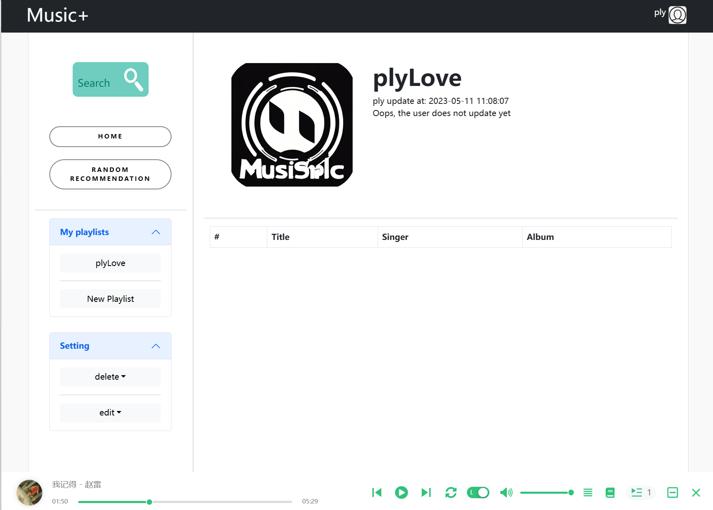

# &#x266b; Music Plus


A music app which provides personalised recommendations based on a user's listening habits and preferences.
Easy to use and no ADs.

## &#x263a; Music APIs source
Our music APIs source base on an open source [NeteaseCloudMusicApi](https://binaryify.github.io/NeteaseCloudMusicApi/#/?id=neteasecloudmusicapi).

## &#x263a; Music Player
Our music player base on an open source program [react-jinke-music-player](https://github.com/uniquemo/react-netease-music).

## ⚠ Caption 

We are using [react-jinke-music-player](https://github.com/uniquemo/react-netease-music) as our player, it does not support **playing audio stream file**. Which means we have to accept whole audio stream file and convert to temporary **blob** file then play this **blob** file. 

## ★ Feature list
* Personalised Song Recommendations
* Great Streaming Quality
* Add Songs to Favorite
* Post comments of songs
* No ADs


## ★ Function list
- [x] Login
    - [x] Login
    - [x] Logout
    - [x] Register
- [ ] Home
    - [x] Poster
    - [x] Random Recommendation (Base on your play history)
    - [x] Random Playlist (Base on public playlist)
    - [ ] ...
- [x] Playlist
    - [x] CURD
    - [x] Image upload
    - [x] Look public playlist
    - [x] Set private 
    - [x] Favourite list
    - [ ] History list
    - [ ] Create/store playlists without logging in (only local)
- [ ] Player
    - [x] Play without login
    - [x] Play list
    - [x] Lyric
    - [x] Icon
    - [x] Order/Single/Random
    - [x] Light/Dark mode
    - [x] Minimize
    - [ ] Audio stream player
- [x] Search
    - [x] Singers
    - [x] Songs
    - [x] Albums
    - [x] Add to playlist
- [ ] comment (comment function is completed on Backend but not in Frontend)
    - [x] add a comment
    - [x] show comments 
    - [ ] exit a comment
    - [ ] remove a comment
    - [ ] like
    - [ ] reply
- [ ] profile
    - [x] show my play list
    - [ ] ...
- [ ] Global setting 
    - [ ] Personal style setting
    - [ ] Language setting
    - [ ] responsive (partially completed)
- [ ] others
    - [ ] Docker deployment
    - [ ] Electron cross-platform deployment


## ▣ Screenshots
- Exmaple

- Home page

- My playlist

- My playlist

- Search a song

- Add a song to my player

- Random Recommendation


## &#x263a; Technique stacks
- React.js (Frontend framework)
- React-Bootstrap (Frontend ui-framework)
- React-paginate (Paginator)
- React-router (Router)
- React-jinke-music-player (Open source music player)
- axios (Http request)
- js-cookie (Sending cookie)
- Javascript (Programming language)
- Express.js (Backend framework)
- nanoid (Generate ids)
- mongoose (ODM)
- morgan (Test tools)
- supertest (Test tools)
- chai  (Test tools)
- chai-http (Test tools)
- assert (Test tools)
- mochawesome (Generate report html document)
- nodemon (Hot reload)
- babel (convert commonjs std to es6 std)

---

## &#x263a; Configuration
```shell
# setup NeteaseCloudMusicApi
cd ./NeteaseCloudMusicApi
set PORT=4000 && node.js # Recommend Cmder terminal
```
```shell
# backend
cd ./MusicPlus/server
vi .env

# copy and paste
DB_URL=mongodb://127.0.0.1:27017/MusicPlus # database, required
NeteaseCloudMusicApi=http://127.0.0.1:4000  # Accessing NeteaseCloud APIs, required
BackendApi=http://127.0.0.1:3000 # For test module, Optional
```
```shell
# frontend
cd ./MusicPlus/client
vi .env

# copy and paste
VITE_BACKEND_BASE_URL=http://127.0.0.1:3000 # Backend API, required
```
## &#x263a; Startup
```shell
# Server
cd ./NeteaseCloudMusicApi
npm install
node app.js
cd ./MusicPlus/server
npm install
npm server  # localhost:3000 in default

# Client
cd ./MusicPlus/client
npm install 
npm run dev
```

## &#x263a; Production
```shell
cd ./MusicPlus/server
npm install
npm run production 
```

## &#x263a; Build
```shell
cd ./MusicPlus/client
npm build
```
